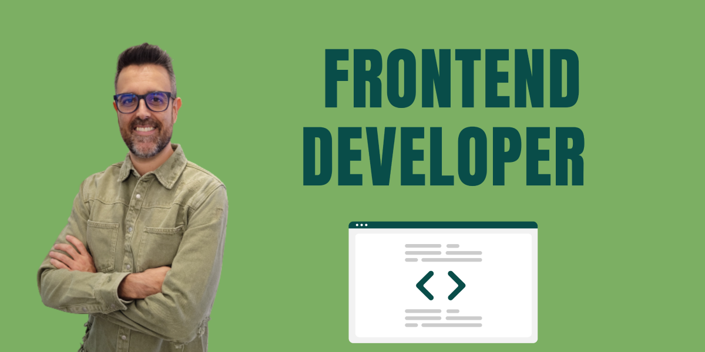

## Hola, soy Gumidafe

### :computer: Actualmente:

- Trabajo en Desic consultora informática, usando el stack Java-Vue.
- Me encanta aprender nuevos conceptos de programación y profundizar sobre las herramientas que uso.
- Afianzar e investigar principios, patrones buenas prácticas y metodologías de desarrollo.

### 📖 Leyendo actualmente: 
- "El programador pragmático" de David Thomas y Andrew Hunt.
- "Código Sostenible" de Carlos Blé.

## Stack:

#### Languages:

#### Application and Data:

#### UX/UI:

#### Utilities:

#### DevOps:

#### Business:

## GitHub Stats

